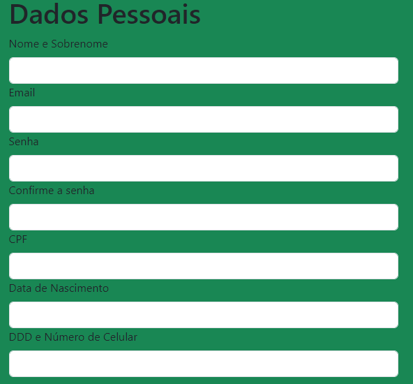
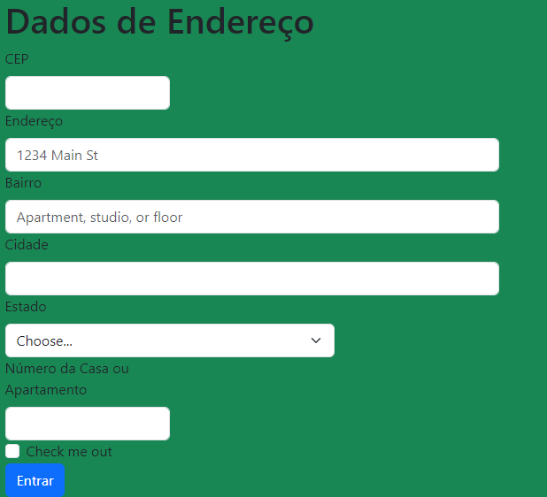

# indice

* [Form CadEcommerce](#form-CadEcommerce)
* [Descrição](#descrição)
* [Introdução](#introdução)
* [Sites Consultados](#Sites-consultados)
* [Funcionalidades](#funcionalidades)
* [Tecnologias Utilidades](#tecnologias-utilizadas)
* [Autores](#autores)

# form-CadEcommerce

## Descrição 📖
-  Este projeto consiste na criação de um site de cadastro de clientes, inspirado em elementos encontrados em três sites de e-commerce. O site permite aos usuários fornecer informações essenciais, como nome, endereço e detalhes de contato, simplificando o processo de registro. Este trabalho destina-se a demonstrar nossas habilidades em HTML e nossa capacidade de sintetizar informações de várias fontes para desenvolver uma solução única.

## Introdução ✉️
Preenchimento de dados em um formulário de cadasro para compra em um site de Ecommerce

 

## Sites consultados
- [Amazon](https://www.amazon.com.br/)
- [Mercado-Livre](https://www.mercadolivre.com.br/)
- [Netshoes](https://www.netshoes.com.br/)
- [boot strap](https://getbootstrap.com/)

## Funcionalidades 🧠
 Aprender a construir uma tabela de formulário de contatos em HTML5

## Tecnologias Utilizadas 🖥️  
- Visual Studio Code;
- CSS3;
- HTML5;
- Github;
- Boot Strap
- Git

 

## Autores 👥
- [Murilo Tonassi](https://github.com/murilo-tonassi)
- [naillim novaski](https://github.com/naillimnovaski)
- [Nicolas Tonassi](https://github.com/nicolas-tonassi)